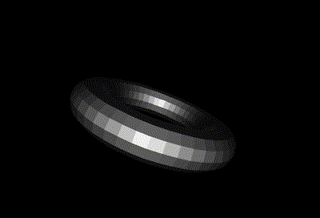

# forth-3d

Educational project that loads a WaveFront OBJ 3D model file and
renders it in software with fixed point arithmetic. The goals are to
make it compatible with old and/or minimalistic implementations of
Forth and run on low end computers.

